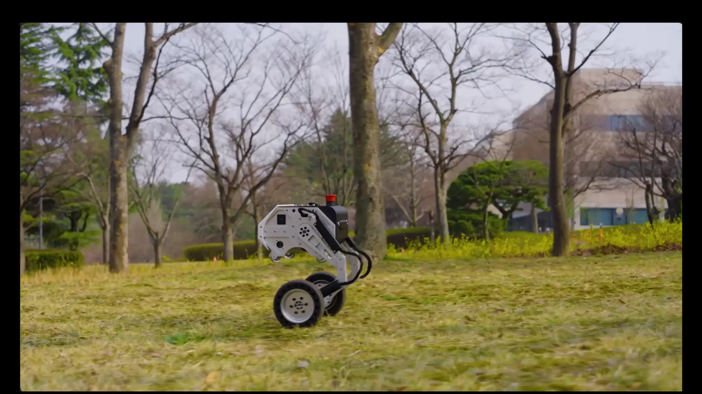
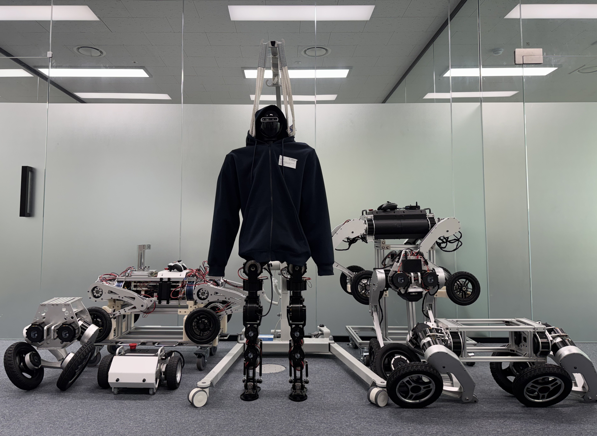

<p align="center">
  
</p>

<p align="center">
  
</p>

<h1 align="center">Physical AI for Legged-Wheeled Robots</h1>

<p align="center">
  <strong>Intelligence in Motion, New Possibility.</strong><br>
  Reinforcement learning environments for COCELO robots in Isaac Lab.
</p>

[](https://docs.omniverse.nvidia.com/isaacsim/latest/overview.html)
[](https://isaac-orbit.github.io/orbit/)
[](https://docs.python.org/3/whatsnew/3.10.html)
[](https://releases.ubuntu.com/20.04/)
[](https://pre-commit.com/)
[](https://opensource.org/license/mit)

## Physical AI Robot Learning
This repository develops reinforcement learning environments for legged-wheeled robots, focusing on embodied
intelligence, locomotion control, and scalable robot policy training in Isaac Lab.

## Setup
- This repo is tested on Ubuntu 20.04, and I recommend you to install 'local install'
### 1. Install Isaac Sim
  ```
  https://isaac-sim.github.io/IsaacLab/main/source/setup/installation/binaries_installation.html
  ```
### 2. Install Isaac Lab
  ```
  https://github.com/isaac-sim/IsaacLab
  ```

### 3. Install lab.cocelo package
i. clone repository
   ```
   git clone https://github.com/jaykorea/Isaac-RL-Two-wheel-Legged-Bot
   ```
ii. install lab.cocelo pip package by running below command
   - run it on 'lab.cocelo' root path
   ```
   conda activate env_isaaclab # change to you conda env
   pip install -e .
   ```
iii. Unzip assets(usd asset) on folder
   - Since git does not correctly upload '.usd' file, you should manually unzip the usd files on assests folder
   ```
    path example: lab/cocelo/assets/data/Robots/Flamingo/flamingo_light_v01_2_2/assets.zip
   ```

## Launch script
  - run it on 'lab.cocelo' root path

### Train
#### Flamingo Light
  ```
    python scripts/rsl_rl/train.py --task Isaac-Velocity-Flat-Flamingo-Light-v1 --num_envs 4096 --headless --num_policy_stacks 2 --num_critic_stacks 2
  ```

#### Flamingo Pro
  ```
    python scripts/rsl_rl/train.py --task Isaac-Velocity-Flat-Flamingo-Pro-v3 --num_envs 4096 --headless --num_policy_stacks 2 --num_critic_stacks 2
  ```

#### Flamingo 4W4L
  ```
    python scripts/rsl_rl/train.py --task Isaac-Velocity-Flat-Flamingo4w4l-v1 --num_envs 4096 --headless --num_policy_stacks 2 --num_critic_stacks 2
  ```

#### Humanoid Light
  ```
    python scripts/rsl_rl/train.py --task Isaac-Velocity-Flat-Humanoid-Light-v1 --num_envs 4096 --headless --num_policy_stacks 2 --num_critic_stacks 2
  ```

### Play
#### Flamingo Light
  ```
    python scripts/rsl_rl/play.py --task Isaac-Velocity-Flat-Flamingo-Light-Play-v1 --num_envs 64 --num_policy_stacks 2 --num_critic_stacks 2 --load_run {folder name}
  ```

#### Flamingo Pro
  ```
    python scripts/rsl_rl/play.py --task Isaac-Velocity-Flat-Flamingo-Pro-Play-v3 --num_envs 64 --num_policy_stacks 2 --num_critic_stacks 2 --load_run {folder name}
  ```

#### Flamingo 4W4L
  ```
    python scripts/rsl_rl/play.py --task Isaac-Velocity-Flat-Flamingo4w4l-v1-Play --num_envs 64 --num_policy_stacks 2 --num_critic_stacks 2 --load_run {folder name}
  ```

#### Humanoid Light
  ```
    python scripts/rsl_rl/play.py --task Isaac-Velocity-Flat-Humanoid-Light-v1-Play --num_envs 64 --num_policy_stacks 2 --num_critic_stacks 2 --load_run {folder name}
  ```
